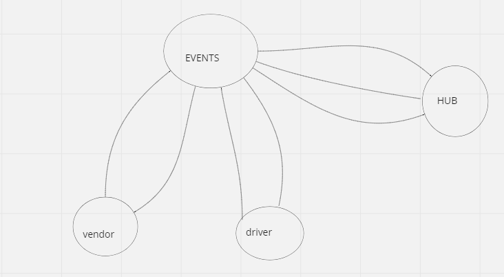

# caps

### Event Driven Applications

- CAPS Phase 1: Begin the build of an application for a company called CAPS - The Code Academy Parcel Service. In this sprint, we’ll build out a system that emulates a real world supply chain. CAPS will simulate a delivery service where vendors (such a flower shops) will ship products using our delivery service and when our drivers deliver them, be notified that their customers received what they purchased.

- Tactically, this will be an event driven application that “distributes” the responsibility for logging to separate modules, using only events to trigger logging based on activity.

### Phase 1 Requirements
- Today, we begin the first of a 4-Phase build of the CAPS system, written in Node.js. In this first phase, our goal is to setup a system of events and handlers, with the intent being to change out the eventing system as we go, but keeping the handlers themselves largely the same. The task of “delivering a package” doesn’t change (the handler), even if the mechanism for triggering that task (the event) does.

### The following user/developer stories detail the major functionality for this phase of the project.

- As a vendor, I want to alert the system when I have a package to be picked up
- As a driver, I want to be notified when there is a package to be delivered
- As a driver, I want to alert the system when I have picked up a package and it is in transit
- As a driver, I want to alert the system when a package has been delivered
- As a vendor, I want to be notified when my package has been delivered
- And as developers, here are some of the development stories that are relevant to the above

### events.js - Global Event Pool (shared by all modules)
### caps.js - Main Hub Application
   - Manages the state of every package (ready for pickup, in transit, delivered, etc)
   - Logs every event to the console with a timestamp and the event payload

### vendor.js - Vendor Module
  - Declare your store name (perhaps in a .env file, so that this module is re-usable)
  - Every 5 seconds, simulate a new customer order
  - storeName, orderId, customerName, address
  - Emit a ‘pickup’ event and attach the fake order as payload

  - Monitor the system for events …
  - Whenever the ‘delivered’ event occurs
  - Log “thank you” to the console
### driver.js - Drivers Module

  - Monitor the system for events …
  - On the ‘pickup’ event …
  - Wait 1 second
  - Log “DRIVER: picked up [ORDER_ID]” to the console.
  - Emit an ‘in-transit’ event with the payload you received
  - Wait 3 seconds
  - Log “delivered” to the console
  - Emit a ‘delivered’ event with the same payload

### Documentation
- Compose a UML or Process/Data Flow Diagram for every application

